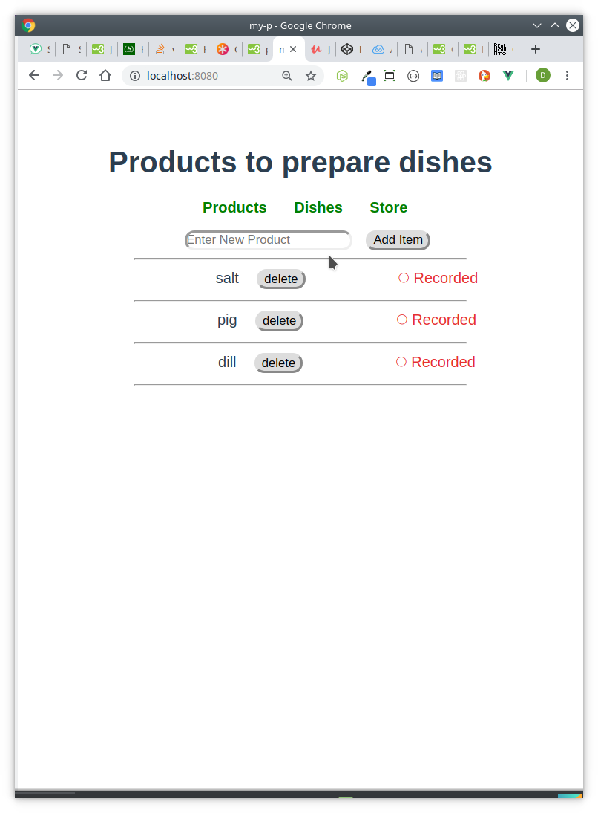

### VueProject

_A._ Please check and install **nodejs + vuejs + webpack**.
Make demo vue project that shows:

_1._ Page A contains List A. User can add, remove, reorder and search items from the list.

_2._ Page B contains List B, where each item contains properties that user can choose from listA (like receipt)

_3._ Please commit the project into git.

 

---

[Read more about the subjects covered in this project in the project Notes file](https://github.com/deyanp19/vueP1/blob/master/my-p/src/assets/Tasks)

#### Technologies required:

- Bootstrap
- HTML, CSS, JavaScript
- Vue
- Nodejs + webpack
