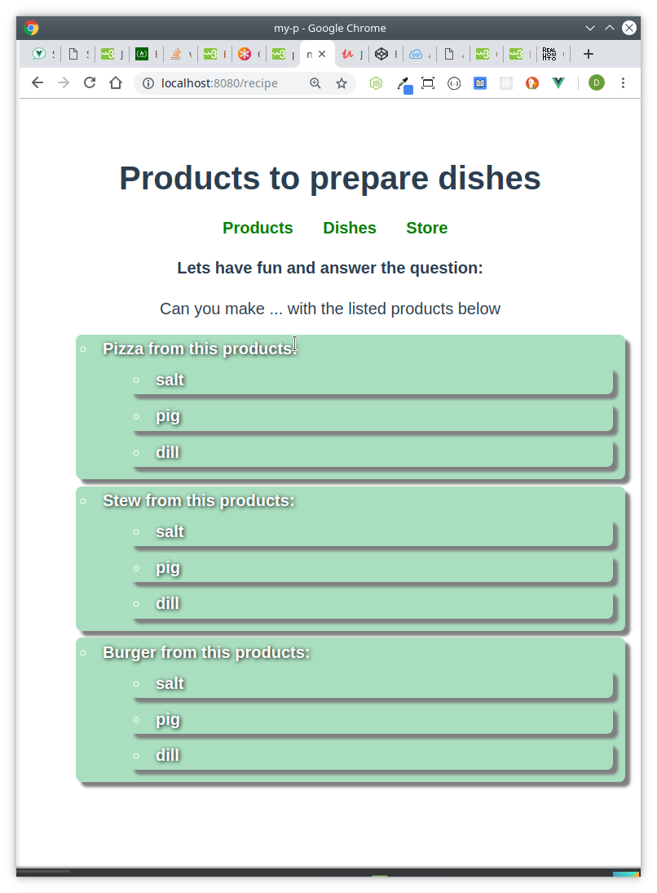

### VueProject 
 
*A.* Please check and  install  nodejs + vuejs + webpack.
Make demo vue project that shows:

*1.* Page A contains List A. User can add, remove, reorder and search items from the list.

*2.* Page B contains List B, where each item contains properties that user can choose from listA (like receipt)

*3.* Please commit the project into git.

#### Technologies required:
* Bootstrap 
* HTML, CSS, JavaScript
* Vue
* Nodejs + webpack
